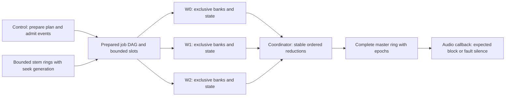

# Plan multicore bank rendering within browser and mobile deadlines

## Owner request and smallest outcome

On 2026-10-02 the owner requests completing #1154's removal of the old multi-lease arena, then designing multicore rendering afresh across browser WebAssembly and iOS/Android. Their browser example is 12 tracks in three four-track banks spread over three workers, then 16 tracks in four banks with one worker taking two. This is a research/design issue: deliver a concrete architecture recommendation, primary-source platform constraints, explicit owner choices, and the smallest bounded feasibility successor. Do not implement a worker pool or revive the removed native dependency-wave scheduler.

## Product and architectural boundaries

Bank jobs and execution workers are distinct: worker count is configured/bounded rather than one thread per bank, tracks remain arbitrary within resources, browser/NEON banks are four lanes and AVX2 banks eight. Compatible program cohorts and scalar/partial tails still apply. Bank assignment must consider cost/dependencies, while actual CPU-core placement is subject to platform scheduling; no promise that a worker equals a reserved physical core. Preserve each lane's DSP arithmetic/bits, deterministic node-ID reductions, explicit sends/sidechains/PDC, stable absolute event sample times, transactional ack/admission, generation-tagged seeks, fixed prepared latency/bypass, bounded streaming and off-render retirement.

The standing launch renderer remains single-threaded until a new implementation issue earns multicore. #1154 implements its safe exclusive arena; this plan must specify ownership/transfer for worker-private state and buffers rather than preserving unsafe foreign leases for future use. No shared mutable DSP state, unconstrained work stealing, heap jobs or unlimited stem/render cache. Render must not acquire OS locks, allocate/free, log, perform I/O or depend on unbounded waits/syscalls. Any proposed conflict with this policy is an explicit owner ruling, not a silent exception.

## Required analysis

- Compare one-quantum parallel dispatch/join with bounded render-ahead/pipelining. Establish which execution context owns the final deadline, what worker completion guarantees actually exist and how scheduling jitter is handled. At 48 kHz a specified 128-frame quantum is 2.667 ms, not a guaranteed amount of available CPU time; use actual host quantum and all four launch rates rather than assuming 128 forever.
- Specify persistent worker pool sizing and bank assignment with 12/16-track examples, unequal effect costs, graph dependencies/sends/sidechains, idle workers, scalar tails and over-subscription. Separate browser, iOS and Android scheduling capabilities from shared engine logic. No unmeasured speedup, latency or core-affinity claim.
- Specify immutable job metadata, exclusive state/buffer ownership, acquire/release publication, bounded queues, block/sample/plan/seek epochs, completion barriers and deterministic reductions. Define worker lateness, backlog, crash, recovery, cancellation and retirement; never mix output from different block/plan generations or race a late worker against callback fallback. Any state continuity limitation must be candid.
- Define any added fixed output/automation latency, admission horizon and PDC/source-ring implications. Show how controls/acks remain correct when frames are already rendered; distinguish silence/bypass/drop/retry behavior and which choices need owner approval. The existing stems-only ruling already permits rendering ahead and a few milliseconds of control latency; the concrete budget and late-block policy, or a wider latency, still need a decision.
- Browser: current AudioWorklet render/deadline/thread rules, SharedArrayBuffer and cross-origin-isolation deployment, Wasm shared memory/atomics, worker priority and suspension/visibility lifecycle, Chrome/Firefox/Safari evidence and unsupported-host fallback. Vendor examples that allow dropped/duplicated blocks are not product acceptance gates. Mobile: official iOS Audio Workgroups/render-block constraints and Android low-latency/worker guidance, thermal and heterogeneous-core limits.

## Evidence and qualification plan

Start with current repo research/rulings and official primary sources; do not inspect or inherit a legacy engine architecture. Cite each platform claim at the supporting primary page, distinguish dated examples, implementation details, current standard requirements and inference. Research may produce a model/diagram and frozen prototype workload/validator proposal, but launch no timing experiment, broad benchmark framework, new corpus or production changes.

Define a stateless smallest feasibility successor with representative real DSP banks, bounded memory, zero callback allocations/frees/locks, deterministic PCM/state, installed allocator controls, deadline completion percentiles/misses, worker-stall fault injection, actual rate/quantum and truthful browser/device execution limits. Choose workload and validator before any later timing; preserve raw failed evidence and do not optimize a descriptive number. Extensive target matrices and infrastructure belong to successors. A single platform proof is not cross-platform qualification or a guarantee on all hardware.

## Execution and decisions

Root Sol approves bounded research; the owner's two GPT-6.1 Sol xhigh agents continue: A implements #1154 and B provides independent safety review plus this read-only research. #1154's frozen implementation review has priority. B may edit only this numbered research spec after root confirms matching GitHub number/title and approves it. Root owns issue/body synchronization and final owner-facing recommendation. No third agent or worker implementation is authorized.

Record owner questions at completion: acceptable additional fixed latency/control horizon, worker late-block policy, supported platform fallback and resource/CPU budget. Do not ask again for already-authorized removal or routine research. The current issue is complete only when the recommendation, evidence, decisions requiring input and bounded successor brief are published and synchronized; a worker implementation is a separate issue.

## Evidence status

Worker B supplied the following source/design review on 2026-10-02. No worker implementation, prototype, timing experiment, new corpus or runtime qualification was performed. #1154's exclusive arena correction remains independent. Root Sol reviewed the ownership/admission/failure protocol and independently checked the Web Audio rendering-thread, HTML blocking-Atomics, dated Chrome Worker-priority and Apple synchronous-workgroup claims. Research verdict: PASS for this bounded recommendation and successor brief; no runtime or performance verdict is implied. The concrete owner choices below remain open.

## Recommendation and existing evidence

Prepare a persistent, configured worker pool with exclusive bank state and bounded preallocated mailboxes. Prefer rendering a small fixed number of quanta ahead, with AudioWorklet/mobile callbacks consuming only complete final blocks. Keep same-quantum parallel execution as a separately qualified candidate, especially on iOS; ordinary browser Workers provide no portable deadline or core-placement guarantee. This is a recommendation inferred from the sources below, not a measured performance result.

The repo's [stems-only ruling](../../docs/rulings/product-scope-stems-for-mixing.md) already permits rendering ahead and a few milliseconds of control latency. Current [realtime policy](../../docs/REALTIME_DEPENDENCY_POLICY.md) forbids blocking or syscalls in render. Historical #009/#039 briefs explain earlier ownership/order constraints and the removed scheduler; no old implementation was inspected or adopted. Current graph ownership, deterministic reductions and source lending were read for #1154. The existing SDK PCM-feed path uses SAB rings without `Atomics.wait`; those are source-feed buffers, not evidence of a multicore DSP renderer.

### Execution choices

| Choice | Deadline owner and completion rule | Assessment |
|---|---|---|
| Same quantum | Callback dispatches ready jobs, performs its own prepared work and uses results only if every required job has completed before the output deadline. | Possible candidate, not a portable guarantee. Waiting for a low-priority Worker can miss the deadline; bounded checks alone do not make a worker ready. No late-job rerun on the callback. Callback waits/wakes cannot silently become a realtime-policy exception. |
| Fixed render-ahead | Worker coordinator renders future blocks and publishes complete ordered masters. Callback checks one expected slot and copies its valid PCM, or performs the approved fault action. | Recommended first feasibility slice. Worker scheduling jitter can consume bounded runway without delaying the callback. Sustained worker throughput still must exceed playback consumption; buffering cannot repair an overloaded graph indefinitely. |

For actual engine quantum `Q` and launch rate `F`, the sample interval is `Q/F` seconds. With `Q=128`, it is 2.902/2.667/1.451/1.333 ms at 44.1/48/88.2/96 kHz respectively. These are arithmetic intervals, not measured CPU budgets. Web Audio's system callback may require multiple render quanta; the 1.1 specification also allows a render-size hint. Inspect the actual accepted host shape rather than assuming a permanent 128-frame callback. [Web Audio processing model](https://www.w3.org/TR/webaudio-1.1/#rendering-loop)

A provisional feasibility configuration is two quanta of additional fixed output latency at 48 kHz/q128: 256 samples, or 5.333 ms. This number is a proposed configuration, not evidence that two quanta cover worker jitter. Freeze the accepted sample/time ceiling before implementation; another host quantum may require a different bounded configuration or fallback. Buffer capacity includes runway plus explicitly counted in-flight slots, not an unbounded backlog.

### Jobs and the requested examples

For twelve compatible tracks, `B0=[0..3]`, `B1=[4..7]`, `B2=[8..11]` are three W4 bank jobs, assigned one each to workers W0/W1/W2. For sixteen compatible tracks, add `B3=[12..15]`: a prepared assignment can be W0=`B0,B3`, W1=`B1`, W2=`B2`. The second W0 job runs after its first; four equal ready jobs therefore require two job durations on the busiest worker before downstream mixing, plus orchestration/reduction costs. This is an idealized scheduling explanation, not a speedup or deadline claim.

Track counts alone do not establish these jobs. The compiler must preserve compatible program cohorts, original bank lane order, padded inactive lanes and scalar/tail fallbacks. Unequal EQ/limiter/insertion costs and dependencies can change the prepared assignment. A bank with an unavailable sidechain or submix input is not ready merely because another bank is idle. Partition a validated job DAG off render, retain deterministic reductions/observer order, and use cost information only from a separately earned model. Configure a fixed maximum pool size, potentially use fewer prepared workers, and never equate `hardwareConcurrency` with reserved cores. Bank/job counts can grow within admitted resources without one thread per bank or a compiled track ceiling. For the first three-worker slice, one of those workers also coordinates publication/reductions; that work is charged to its load rather than assuming a fourth reserved execution core.

## Ownership and publication protocol

1. Prepare immutable job IDs/dependencies, worker assignments, capacities, lane masks, PDC storage and state owners before publication. A worker exclusively owns each bank's DSP/smoothing/delay state. One bank's successive blocks run in sample order, exactly once. No foreign mutable arena lease or shared mutable DSP instance is retained for future concurrency.
2. Each command/result identifies plan revision, playback/seek epoch, absolute first sample, frame count, job ID and slot sequence. Commands reference the admitted ordered event span; revisions distinguish event/control snapshots. A u64 counter or explicit checked wrap policy is needed before any slot/epoch reuse. A block's master must never combine jobs from differing metadata.
3. A producer owns an EMPTY slot while writing its PCM/metadata; release publication makes it READY. The designated consumer acquires READY, verifies the exact expected metadata, owns it while reading, then release-publishes EMPTY. A producer cannot overwrite or free a slot still owned by a consumer. Shared inputs remain immutable until every named consumer finishes; published completion counts are bounded by the prepared job list. Error selection, reductions and observation publication use prepared stable order, never arrival order.
4. Prefer private Wasm instances/storage per worker and explicit SAB transport slots for the first feasibility slice. This keeps Rust DSP ownership local but introduces bounded copies and possibly module memory duplication; charge every transport copy and measure total scheduling/transport/reduction cost before claiming a gain. This is a feasibility tradeoff, not approval to retain avoidable production copies. A shared-Wasm-memory alternative may reduce transport copies, but requires a separately reviewed initialization/stack/TLS/allocator/ownership design. Neither is a reason to retain the old unsafe arena API. Native workers likewise own their state and transfer or lend checked completed buffers.
5. Worker orchestration/wait/wake, priority/workgroup setup and control supervision stay outside the callback and DSP entry. Plain bounded atomic publication is not a permission to hide `Atomics.notify`, OS wakes or a spin-until-ready loop in render. Freeze the allowed orchestration seam in the successor, including per-worker audit scope; all participating DSP paths retain zero allocations/frees/locks/I/O/syscalls.

### Lateness, cancellation and failure

Recommended fault semantics: at an absent/invalid expected master, write `+0.0` for that exact playback block and increment a visible missed-block counter. Do not play old PCM again, shift the timeline, mix partial banks, or report silence as successful rendering. One bounded status check is sufficient for the callback; it never waits for a late worker. The owner must approve this product fault policy before implementation.

For an isolated late block, finish its already-issued jobs once in order, discard its expired master and retain their advanced state for the next block. This preserves subsequent reference-state progression only if the pipeline can catch up without exceeding its bounded queues; it does not repair the audible gap. Reject new work on full queues. Persistent lateness or a crashed worker enters an explicit failed playback epoch and silence/stop state. Control may prepare and publish a fresh epoch after owners are reclaimed, but a lost worker's DSP continuity is not recoverable without a separately authorized state strategy. Do not promise seamless reset.

Cancel queued work by epoch; an in-flight job cannot be synchronously canceled or re-executed against its mutable state. Its storage stays exclusively owned until completion or confirmed worker termination. Plan replacement and seek flush old output eligibility immediately at the chosen boundary, then retire old jobs/storage off callback after all references end. Suspend/resume, tab lifecycle, route/rate/quantum changes and mobile interruptions are explicit stop/re-prime or failure boundaries, not silent backlog growth. Workers may be suspended or terminated by the browser; finite runway is not an operating-system scheduling guarantee. [HTML worker processing and lifetime](https://html.spec.whatwg.org/multipage/workers.html#the-worker's-lifetime)

## Sample time, admission and fixed latency

Use separate playback and committed-render cursors. With ahead distance `L` samples, a content block starting at `s` is played at the corresponding output time `s+L`; telemetry carries the content timestamp and its playback mapping. Fixed ahead latency applies uniformly after all routes, leaving existing internal PDC differences and bypass latency intact. Source rings must supply the admitted content horizon, with original seek generation checks and bounded underrun behavior; they may not become a whole-stem cache.

An event can affect only a block not yet committed or dispatched to its state owner. Expose the earliest admissible application sample. A stale absolute request is rejected with a typed response; an immediate control is assigned a future application sample and its ack reports that same contract sample. Admit a multi-bank batch atomically before any affected worker can execute it; if a destination has insufficient capacity, publish nothing and do not advance the ledger. The known ack-before-drop defect remains the review question. Automation uses original absolute sample positions and ordered spans, not callback arrival time. The concrete API mapping between content and output sample time must be frozen with existing command/ack consumers; do not silently reinterpret their fields.

Changing worker count, ahead distance or device shape requires preparation and a documented publication/re-prime boundary. Do not vary latency per block to conceal late jobs. Host buffering latency, device latency and engine PDC remain separately reported so the additional fixed `L` is charged exactly once.

## Primary-source platform constraints

| Platform/source | Established constraint | Consequence for this proposal |
|---|---|---|
| [Web Audio 1.1 AudioWorklet scope](https://www.w3.org/TR/webaudio-1.1/#AudioWorkletGlobalScope) | One scope and one rendering thread per context. | More AudioWorklet nodes are not a portable parallel worker pool. Use persistent Workers for off-callback jobs. The 1.1 text is specification evidence, not a claim that every deployed browser implements its new quantum hints. |
| [HTML agents](https://html.spec.whatwg.org/multipage/webappapis.html#agents) | Only dedicated/shared worker agents allow potentially blocking JavaScript Atomics operations. | No `Atomics.wait` join in AudioWorklet. Scheduling APIs do not establish a worker completion deadline. |
| [Chrome AudioWorklet design pattern, 2018](https://developer.chrome.com/blog/audio-worklet-design-pattern) | Its SAB/Worker design keeps the worklet nonblocking and describes lower Worker priority. | Useful dated vendor guidance; its tolerated duplicated/dropped audio is not our acceptance contract. It does not qualify current Chrome, Firefox or Safari deadlines. |
| [HTML shared serialization](https://html.spec.whatwg.org/multipage/structured-data.html#structuredserializeinternal), [cross-origin isolation](https://html.spec.whatwg.org/multipage/webappapis.html#dom-crossoriginisolated) | SAB sharing depends on cross-origin isolation and the agent cluster; deployment headers/permissions matter. | Preflight the actual context and Worker/worklet sharing. Use the existing sequential renderer if the multicore capability is unavailable; do not silently substitute an allocating per-block message transport. |
| [WebAssembly threads proposal](https://github.com/WebAssembly/threads/blob/main/proposals/threads/Overview.md), [Rust Wasm target](https://doc.rust-lang.org/rustc/platform-support/wasm32-unknown-unknown.html), [Rust Wasm atomics](https://doc.rust-lang.org/core/arch/wasm32/#atomics) | Shared memory has an explicit maximum; instantiation copies active data segments; Wasm does not create host threads. Ordinary Rust `std::thread::spawn` is unavailable on this target and atomics compilation needs appropriate support. | JS owns Worker creation. Shared-instance memory initialization cannot overwrite live state; preallocate before playback and forbid growth during DSP. Do not assume the existing nonshared artifact becomes thread-safe by adding one flag. |
| [Apple parallel audio threads](https://developer.apple.com/documentation/audiotoolbox/adding-parallel-real-time-threads-to-audio-workgroups), [workgroup overview](https://developer.apple.com/documentation/audiotoolbox/understanding-audio-workgroups) | Realtime auxiliary threads serving the I/O deadline join its device workgroup; ordinary nonrealtime threads cannot simply join. | iOS has an explicit scheduling integration for same-cycle candidates. Join/leave/priority setup belongs to host preparation; joining is assistance, not a universal deadline guarantee. |
| [Apple asynchronous audio threads](https://developer.apple.com/documentation/audiotoolbox/adding-asynchronous-real-time-threads-to-audio-workgroups), [WWDC20 workgroups](https://developer.apple.com/videos/play/wwdc2020/10224/) | Asynchronous workers use a custom interval workgroup; the API recommends an effective maximum parallel thread count. | A render-ahead pool has its own deadline; do not incorrectly join unrelated cycles to the device's workgroup. Revalidate workgroup/routing lifecycle and pool use at a prepared boundary, not by spawning during render. |
| [Apple render block](https://developer.apple.com/documentation/audiotoolbox/auaudiounit/renderblock), [internal render contract](https://developer.apple.com/documentation/audiotoolbox/auinternalrenderblock) | Hosts cache the render block before realtime invocation. Render owns the requested frame interval and ordered events; returned internal memory remains valid until the next render or resource deallocation. | Prepare resources/call targets first, preserve continued ramps across blocks, and never recycle a worker's returned storage while the sink still reads it. Keep the repo's stronger zero-allocation/lock/syscall callback rule. |
| [Android AAudio](https://developer.android.com/ndk/guides/audio/aaudio/aaudio), [Oboe callback guidance](https://developer.android.com/games/sdk/oboe/low-latency-audio) | AAudio's callback has elevated scheduling; callbacks must avoid blocking. Ordinary thread jitter and larger buffers trade latency. | Keep the output callback as the bounded consumer. No evidence that arbitrary bank workers inherit callback priority. Actual callback frame count/burst and route changes must be recorded. |
| [Android thread priorities](https://developer.android.com/reference/android/os/Process#THREAD_PRIORITY_URGENT_AUDIO), [performance hints](https://developer.android.com/reference/android/os/PerformanceHintManager.Session), [heterogeneous scheduling](https://developer.android.com/android-performance-analyzer/analyze/thread-sched), [thermal guidance](https://developer.android.com/games/optimize/adpf/thermal) | Urgent-audio priority is not normally for application reassignment; hints guide frequency/placement, with device-specific cores and thermal limits. | Do not promise three reserved big cores or manually pin a pool as the default. Configure/measure supported worker scheduling and hints outside DSP; sample thermal state off callback. Thermal pressure may require refusal/re-prime, not silently cheaper DSP or changed bits. |

No current Chrome/Firefox/Safari or physical iOS/Android runtime completion evidence was collected. Existing single-thread qualification is not multicore evidence. A particular thread count, workgroup, priority or hint never proves a deadline on all hardware.

## Smallest bounded feasibility successor

After #1154 is delivered and the concrete output/control budget and missed-block policy are accepted, brief one opt-in browser feasibility slice: one persistent three-Worker pool, fixed ahead distance, actual shipped AudioWorklet sink and private worker state. Keep the production default sequential. Use existing public compiler/builtin/effect paths with the requested 12/16-track homogeneous W4 cases; select one existing stateful bank and an existing send/sidechain/PDC/control scenario rather than create a new corpus. Admission preflights ownership, SAB/isolation, memory/queue limits and actual rate/quantum before publication.

Freeze workload, validator, artifact and timing recipe before running it. Qualify first on one named browser/device at 48 kHz and its actual accepted quantum. Non-timed gates: exact PCM plus continuation state against current sequential owners, deterministic reductions and telemetry under permuted completion, partial/padded lanes, full queues/atomic batch refusal, stale seek/plan/event epochs, an injected late worker, and exactly-once completion/retirement. Each fault case must name its defect: stale epoch mixing, ack-before-drop, reuse of an in-flight slot, or duplicate state advancement. Use installed allocator counters after warmup on the callback and every DSP worker, with independent negative controls; record bounded retained storage and source duration independence.

Only after those gates pass should a separately authorized frozen invocation collect raw callback/worker completion distributions, deadline misses, underruns and their sample/epoch identities, plus actual browser/OS/hardware/rate/quantum/visibility/thermal metadata. A deliberate worker stall must leave callback duration bounded and produce the approved silence/failed-epoch behavior. Preserve the first raw failure rather than repair a validator by rerunning. No timing was launched in #1177, and no numeric speedup or admission threshold is proposed from this review. Wider browser/version/rate/device/thermal qualification and iOS/Android integrations are separate bounded successors; one desktop browser proof is not mobile or cross-browser qualification.

## Concrete decisions still needed

- Accept the initial two-quantum/q128/48-kHz feasibility horizon (5.333 ms additional fixed latency), or give another sample/time ceiling. Render-ahead and a few milliseconds of control latency are already authorized in principle.
- Approve whole-master silence with an explicit missed-block counter for one late block, then failed-epoch silence/stop for a bounded persistent-lateness/crash threshold; freeze that threshold and user-visible recovery behavior.
- Retain sequential fallback on unsupported multicore hosts and choose the pool/memory/CPU admission budget. No hardware-core guarantee or mandatory multicore selection is implied.

Research outcome is this reviewed recommendation and bounded successor proposal, not an implemented capability. Publication is completed by the matching GitHub issue/body synchronization; the owner decisions above remain pending before a separately briefed implementation.
